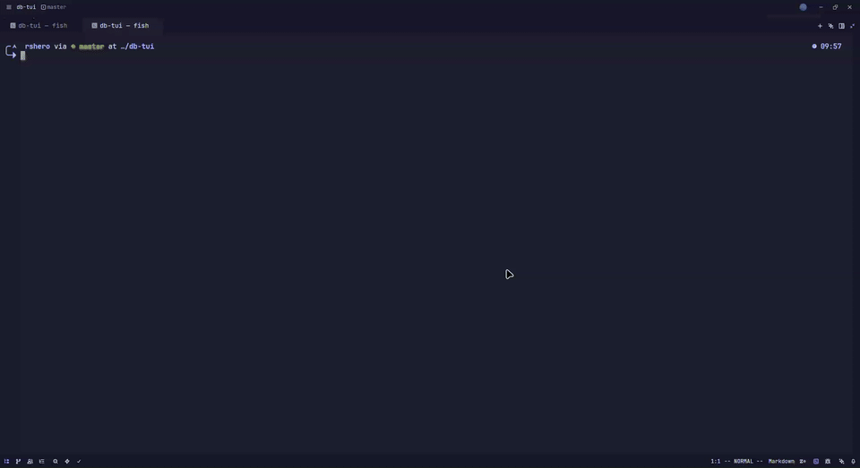

<div align="center">

# Nexus

**A tool for browsing databases**

[](#)
[](#)
[](#)
[](#)
[](#)



```
╭─ Connections ─────╮╭─ [users] [orders] [keys:*] ──────────────────╮
│ ▸ Production Mongo ││ Filter: { status: "active" }  Sort: _id ↓   │
│   ▸ mydb           ││─────────────────────────────────────────────││
│     ◦ users    120 ││ _id    │ name     │ email          │ age    │
│     ◦ orders   3.2k││ 64a..  │ Alice    │ alice@mail.com │ 28     │
│ ▸ Local Redis      ││ 64b..  │ Bob      │ bob@mail.com   │ 34     │
│ + Add Connection   ││                                             │
╰────────────────────╯╰─────────────────────────────────────────────╯
```

</div>

## Features

- **Multi-database support** — MongoDB, MySQL, PostgreSQL, and Redis from a single interface
- **Tree-based navigation** — browse connections, databases, and collections/tables in a sidebar
- **Interactive data table** — virtual-scrolled table with syntax-highlighted values and type coloring
- **Tab system** — explore multiple collections simultaneously with a tabbed interface
- **Query execution & logging** — run queries with a dedicated log panel showing timing and row counts
- **Collection search** — search and filter collections/tables across databases
- **Keyboard-driven** — full keyboard navigation with context-sensitive shortcuts and focus zones
- **Connection management** — persistent profiles with URL or manual host/port configuration
- **OS keyring integration** — securely store connection credentials
- **TLS support** — connect to databases over encrypted connections
- **Clipboard integration** — auto-copy selections via OSC 52
- **Responsive layout** — adapts to terminal width with collapsible panels

## Getting Started

### Prerequisites

- [Bun](https://bun.sh) runtime

### Install & Run

- Release binaries are available in the [releases tab](https://github.com/rshero/nexus/releases/)

```bash
bun install
bun start
```

For development with hot reload:

```bash
bun dev
```

## Roadmap

- [x] Detail panel & inline editing
- [x] Command palette with fuzzy search
- [x] Query executor and auto completions
- [x] Loading states, error handling & polish
- [ ] Multiple View options (json, text, tree etc.) - Not considering it right now
